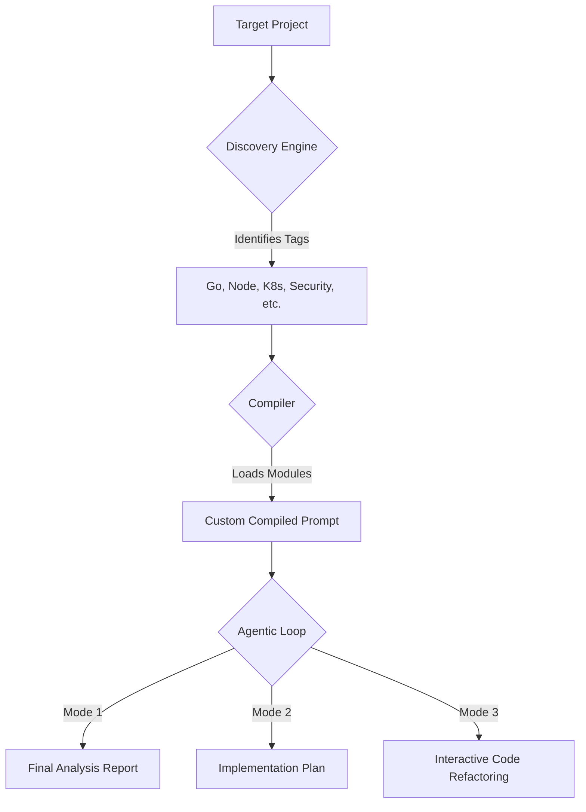

# 🔍 Beyan — AI-Powered Agentic Project Analysis Framework

<p align="center">
  <em>Autonomous Intelligence for Deep Technical Audits & Refactoring</em>
</p>

<p align="center">
  
  
  
  
</p>

<p align="center">
  <a href="README.md">English</a> · <a href="README_TR.md">Türkçe</a>
</p>

---

# 🚀 The Agentic Evolution (v2.0)

Beyan has evolved from a static prompt library into a **fully autonomous agentic framework**. It no longer just provides "what" to ask; it manages the **"how"** of analysis and execution.

### 🧠 The Beyan v2.0 Engine
- **Autonomous Discovery**: Automatically fingerprints 20+ technologies in your project.
- **Smart Compilation**: Dynamically builds a context-dense master prompt by selecting only relevant expert modules.
- **Agentic Loop (Mode 3)**: A semi-autonomous cycle that follows a **Analyze → Plan → Code → Test → Commit** workflow with human-in-the-loop safety gates.
- **Token Budgeting**: Intelligent module pruning to fit massive codebase context into LLM limits.

---

## 🚦 Quick Start

Get your first deep analysis report in seconds:

```bash
# 1. Setup
git clone https://github.com/XINMurat/beyan.git
cd beyan/v2
pip install -r requirements.txt

# 2. Run Analysis (Mode 1)
python cli/analyzer.py --target /path/to/your/project --mode 1 --lang en --api openai

# 3. Interactive Fix (Mode 3)
python cli/analyzer.py --target /path/to/your/project --mode 3 --lang en --api anthropic
```

---

## ⚙️ How It Works (The v2.0 Workflow)

Unlike the manual process of v1.0, Beyan v2.0 automates the entire analytical pipeline:



---

## 🧩 The Core Knowledge Base (Legacy v1.0 Prompts)

Beyan v2.0 is powered by the battle-tested v1.0 prompt family. You can still use these prompts manually for specialized needs:

### Project-Type Prompts
- [Application Analysis](en/project-type/application_analysis_prompt_v2.3.md)
- [OS / System Software](en/project-type/os_system_analysis_prompt_v1.0.md)
- [Research / AI-ML](en/project-type/research_ai_analysis_prompt_v1.0.md)
- [Data & Analytics](en/project-type/data_analytics_analysis_prompt_v1.0.md)
- [Infrastructure / DevOps](en/project-type/infrastructure_devops_prompt_v1.0.md)
- [Legacy / Migration](en/project-type/legacy_migration_prompt_v1.0.md)
- [Blockchain](en/project-type/blockchain_analysis_prompt_v1.0.md)

### Focus & Tooling
- [Security Audit](en/focus/security_audit_prompt_v1.0.md) | [Performance Audit](en/focus/performance_audit_prompt_v1.0.md)
- [Remediation Plan](en/cross-cutting/remediation_plan_prompt_v1.0.md) | [Health Score](en/cross-cutting/health_score_prompt_v1.0.md)

---

## 🏛️ Design Principles

- **NOT DETECTED Contract**: If information isn't found, the agent flags it. Never halluncinates.
- **Two-Layer Analysis**: Descriptive layer (facts) first, then Evaluative layer (judgment).
- **Safety Gating**: Mode 3 creates a safety branch and asks for confirmation before every single file change.
- **Reconstructibility**: "A new developer should be able to reconstruct the entire system solely from the analysis output."

---

## 📂 Project Structure

- `v2/`: The core Agentic Framework (CLI, Orchestrator, Discovery).
- `tr/` & `en/`: The multi-language expert prompt modules.
- `.github/`: CI/CD workflows for automated testing.

---

## ⚖️ License
[MIT](LICENSE) — free to use, modify, and distribute.

---

## Acknowledgements
Beyan was developed through an iterative self-referential process: designed, then audited using its own Meta Audit prompt, improved based on findings, and health-scored before release.
