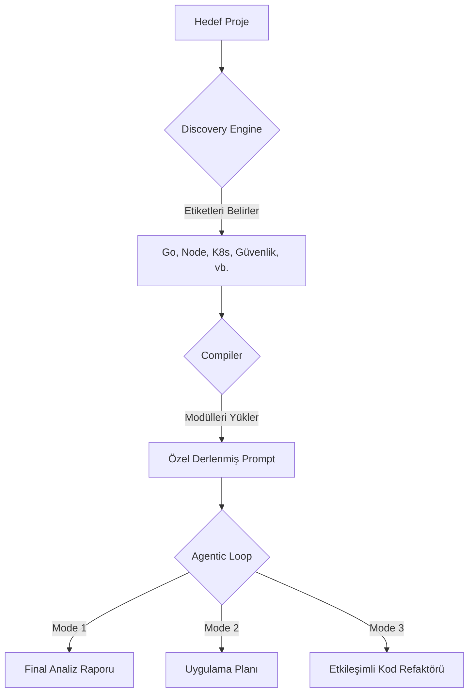

# 🔍 Beyan — Yapay Zeka Destekli Otonom Proje Analiz Çerçevesi

<p align="center">
  <em>Derin Teknik Denetim ve Otomatik Refaktör İçin Otonom Zeka</em>
</p>

<p align="center">
  
  
  
  
</p>

<p align="center">
  <a href="README.md">English</a> · <a href="README_TR.md">Türkçe</a>
</p>

---

# 🚀 Agentic Evrim (v2.0)

Beyan, statik bir prompt kütüphanesinden **tam otonom bir agentic framework** yapısına evrildi. Artık sadece "ne" sorulacağını değil, analizin ve icraatın **"nasıl"** yapılacağını da yönetiyor.

### 🧠 Beyan v2.0 Motoru
- **Otonom Keşif (Discovery)**: Projenizdeki 20'den fazla teknolojiyi otomatik olarak tespit eder.
- **Akıllı Derleme (Compiler)**: Sadece ilgili uzman modülleri seçerek bağlamı yoğun bir ana prompt oluşturur.
- **Agentic Döngü (Mode 3)**: **Analiz → Plan → Kod → Test → Commit** iş akışını insan onaylı güvenlik kapılarıyla yöneten yarı-otonom döngü.
- **Token Bütçeleme**: Devasa kod tabanlarını LLM limitlerine sığdırmak için akıllı modül budama (pruning) zekası.

---

## 🚦 Hızlı Başlangıç

Saniyeler içinde derin bir teknik analiz raporu alın:

```bash
# 1. Kurulum
git clone https://github.com/XINMurat/beyan.git
cd beyan/v2
pip install -r requirements.txt

# 2. Analiz Çalıştır (Mode 1)
python cli/analyzer.py --target /proje/yolu --mode 1 --lang tr --api openai

# 3. Etkileşimli Düzeltme (Mode 3)
python cli/analyzer.py --target /proje/yolu --mode 3 --lang tr --api anthropic
```

---

## ⚙️ Nasıl Çalışır? (v2.0 İş Akışı)

v1.0'ın manuel sürecinin aksine, Beyan v2.0 tüm analitik boru hattını otomatikleştirir:



---

## 🧩 Çekirdek Bilgi Hazinesi (v1.0 Prompt Kütüphanesi)

Beyan v2.0, sahada test edilmiş v1.0 prompt ailesinden güç alır. Özel ihtiyaçlarınız için bu promptları hala manuel olarak kullanabilirsiniz:

### Proje Türü Promptları
- [Uygulama Analizi](tr/proje-turu/master_proje_analiz_promptu_v2.3.md)
- [OS / Sistem Yazılımı](tr/proje-turu/os_analiz_promptu_generic_v1.0.md)
- [Araştırma / AI-ML](tr/proje-turu/research_ai_analiz_promptu_generic_v1.0.md)
- [Veri ve Analitik](tr/proje-turu/veri_analitik_analiz_promptu_v1.0.md)
- [Altyapı / DevOps](tr/proje-turu/altyapi_devops_analiz_promptu_v1.0.md)
- [Legacy / Göç](tr/proje-turu/legacy_goc_analiz_promptu_v1.0.md)
- [Blockchain](tr/proje-turu/blockchain_analiz_promptu_v1.0.md)

### Odak ve Araçlar
- [Güvenlik Denetimi](tr/odak/guvenlik_denetim_promptu_v1.0.md) | [Performans Denetimi](tr/odak/performans_denetim_promptu_v1.0.md)
- [Düzeltme Planı](tr/yatay-araclar/duzeltme_plani_uretici_promptu_v1.0.md) | [Sağlık Skoru](tr/yatay-araclar/proje_saglik_skoru_promptu_v1.0.md)

---

## 🏛️ Tasarım İlkeleri

- **TESPİT EDİLEMEDİ Sözleşmesi**: Bilgi bulunamazsa ajan bunu işaretler. Asla halüsinasyon görmez.
- **İki Katmanlı Analiz**: Önce tanımlayıcı katman (olgular), sonra değerlendirici katman (yargı).
- **Güvenlik Kapıları**: Mode 3, her dosya değişikliğinden önce bir güvenlik branch'i oluşturur ve onay ister.
- **Yeniden İnşa Edilebilirlik**: "Yeni bir geliştirici, yalnızca analiz çıktılarına bakarak tüm sistemi yeniden inşa edebilmeli."

---

## 📂 Proje Yapısı

- `v2/`: Çekirdek Agentic Framework (CLI, Orchestrator, Discovery).
- `tr/` & `en/`: Çok dilli uzman prompt modülleri.
- `.github/`: Otomatik testler için CI/CD iş akışları.

---

## 📝 Yazılar

- [Tek Komutla Tüm Kod Tabanınızı Analiz Eden Bir AI Ajanı Geliştirdim](https://dev.to/xinmurat_4942570d69/i-built-an-ai-agent-that-analyzes-your-entire-codebase-in-one-command-oil) — Dev.to

## ⚖️ Lisans
[MIT](LICENSE) — serbestçe kullanın, değiştirin, dağıtın.

---

## Teşekkür
Beyan, yinelemeli öz-referanslı bir süreçle geliştirildi: tasarlandı, ardından kendi Meta Denetim promptuyla analiz edildi, iyileştirildi ve sağlık skoru alındı.
