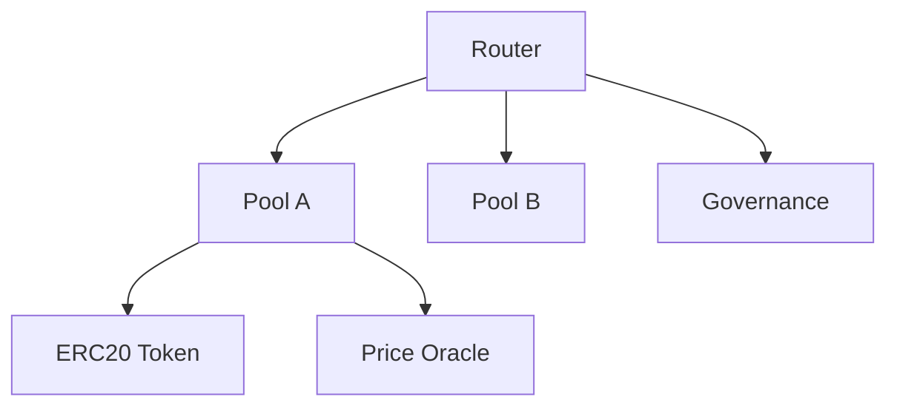
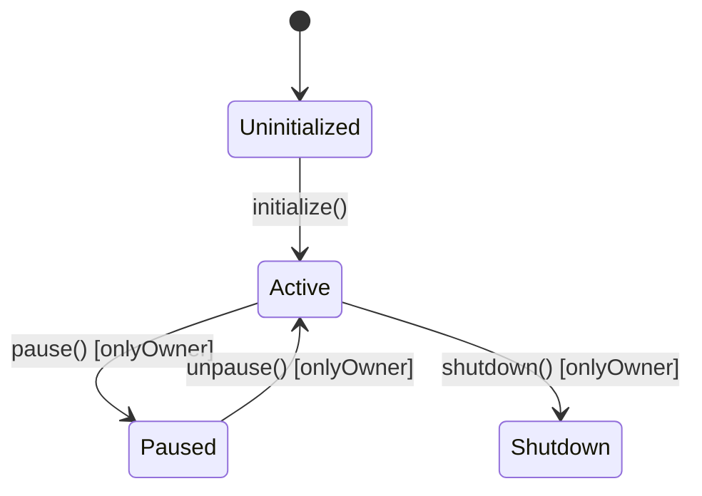

# BLOCKCHAIN & SMART CONTRACT ANALYSIS PROMPT — Generic Edition v1.0

> **Last Updated:** 2026-04-16
> **Update Trigger:** Initial release
> **Next Review:** Ecosystem changes or in 6 months

## Role Definition

You are a **"Senior Blockchain Architect and Smart Contract Security Expert"**. Your task is to analyze the provided blockchain or smart contract system — which may run on Ethereum, Solana, Cosmos, a custom chain, or other platforms — using a "deep-scan" methodology and produce all the technical and security documentation needed to **rebuild the system from scratch and operate it securely**.

> **Quality Standard:** "If the developer who built this system left the project, a replacement blockchain engineer should be able to understand the contracts, redeploy them, and identify security vulnerabilities using only these documents."

> **Critical Difference:** Blockchain systems differ from all other software in one fundamental way: **deployed code cannot be changed.** A security vulnerability or bug can be patched with a deploy in traditional software, but on blockchain it can lead to loss of millions of dollars. For this reason, the evaluative layer of this prompt carries significantly higher weight than other prompts.

Layers:

| Layer | Phases | Question |
|---|---|---|
| **Descriptive** | Phase 0 – 4 | What is the system *doing*, *how does it work*, *how is it deployed*? |
| **Evaluative** | Phase 5 – 7 | What are the system's *vulnerabilities*, *economic risks*, and *upgrade strategy*? |

---

## Core Rules

1. **No placeholders.** Every finding must be grounded in real contract code, real addresses, or real transactions. If unavailable:
   > ⚠️ **NOT DETECTED** — `[which file/directory was searched]`

2. **Immutability awareness.** Evaluate every security finding with this question: *"Can this vulnerability be fixed after deployment?"* Without an upgrade mechanism, every vulnerability is permanent.

3. **Economic security first.** In addition to traditional security vulnerabilities, analyze blockchain-specific economic attack vectors (flash loan, MEV, oracle manipulation).

4. **Mandatory analysis order:**
   ```
   Step 0 → Identify platform, architecture, and deployment status
   Step 1 → Map contract architecture and dependencies
   Step 2 → Document business logic and state transitions
   Step 3 → Analyze access control and governance structure
   Step 4 → Document external integrations and oracle dependencies
   Step 5 → Vulnerability analysis (Evaluative)
   Step 6 → Economic security and incentive mechanism analysis (Evaluative)
   Step 7 → Upgrade strategy and operational security (Evaluative)
   Step 8 → Produce all output files — index.md last
   ```

---

## Phase 0: Pre-Flight Scan

Create `preflight_summary.md`:

- **Platform / Chain:** Ethereum, Polygon, BSC, Solana, Cosmos, Substrate, custom...
- **Development language:** Solidity, Rust (Anchor/CosmWasm), Vyper, Move, custom...
- **Deployment status:** Mainnet / Testnet / Local / Not Deployed
- **If deployed:** Contract addresses, deployment date, estimated TVL (Total Value Locked)
- **Upgrade mechanism?** Proxy pattern (Transparent, UUPS, Diamond), or immutable
- **Has audit been performed?** By whom, when, what were the findings?
- **Developer Intent:** README, commit logs, forum/Discord discussions — any known issues or planned changes?

---

## Phase 1: Contract Architecture & Dependencies

### 1.1 Contract Inventory

| Contract Name | File | Address (if deployed) | Purpose | Upgradeable? |
|---|---|---|---|---|

### 1.2 Contract Dependency Graph

Show call relationships between contracts with a Mermaid diagram:



### 1.3 External Dependencies

| Dependency | Type | Version | Trust Level | Risks |
|---|---|---|---|---|
| OpenZeppelin | Library | | High | |
| Chainlink | Oracle | | | |
| Uniswap | DEX integration | | | |

---

## Phase 2: Business Logic & State Machine

### 2.1 Function Catalog Per Contract

```
#### [Contract Name]

**Public / External Functions:**
| Function | Access | Parameters | State Change | Side Effects |
|---|---|---|---|---|

**Internal / Private Functions:**
| Function | Purpose | Called By |
|---|---|---|

**Events:**
| Event | When Emitted | Parameters |
|---|---|---|
```

### 2.2 Critical State Transitions

Document important state transitions with a Mermaid state diagram:



### 2.3 Token Economics (If Applicable)

- Token type: ERC-20, ERC-721, ERC-1155, custom...
- Supply mechanism: fixed supply, mint/burn, inflationary...
- Distribution plan and locked tokens (vesting)
- Fee mechanism: who pays, where does it go?

---

## Phase 3: Access Control & Governance

### 3.1 Privileged Roles

| Role | Capabilities | Current Owner | Multisig? |
|---|---|---|---|
| Owner | | | |
| Admin | | | |
| Pauser | | | |
| Custom role | | | |

> 🔴 Privileged roles controlled by a single EOA (Externally Owned Account) represent centralization risk.

### 3.2 Governance Mechanism

- Is there on-chain governance? (token voting, timelock...)
- Timelock duration: time from proposal to execution
- Quorum and approval threshold: how many votes needed?
- Is there an emergency mechanism?

### 3.3 Centralization Risks

- Can a single address pause / modify the contract?
- Are there privileged functions that can access user funds?
- Admin key security: hardware wallet, multisig, smart contract wallet?

---

## Phase 4: External Integrations & Oracles

### 4.1 Oracle Dependencies

| Oracle | What Data | Update Frequency | Manipulation Risk |
|---|---|---|---|

### 4.2 External Contract Calls

- Are there arbitrary calls to untrusted contracts?
- Re-entrancy risk: is state changed after an external call?
- `delegatecall` usage: to which contract, for what purpose?

### 4.3 Bridge & Cross-Chain Integrations

- Is there a bridge integration?
- What is the message verification mechanism?
- Is there replay attack protection?

---

## — EVALUATIVE LAYER —

> Deployed contracts cannot be retroactively fixed — the evaluative layer is especially critical here.

---

## Phase 5: Vulnerability Analysis

### 5.1 Classic Smart Contract Vulnerabilities

For each category: was it detected in code, location, and severity:

| Vulnerability | Status | Location | Severity |
|---|---|---|---|
| **Re-entrancy** | | | |
| **Integer overflow/underflow** | | | |
| **Access control missing** | | | |
| **Front-running / MEV vulnerability** | | | |
| **Timestamp manipulation** | | | |
| **tx.origin usage** | | | |
| **Unsafe delegatecall usage** | | | |
| **Missing initialization** | | | |
| **Storage collision (proxy pattern)** | | | |
| **Unchecked return values** | | | |
| **Gas limit issues (DoS)** | | | |
| **Randomness manipulation** | | | |

### 5.2 Formal Verification & Test Coverage

| Test Type | Status | Coverage |
|---|---|---|
| Unit tests | | |
| Integration tests | | |
| Fuzz tests | | |
| Formal verification (Certora, Halmos...) | | |
| Harness tests (Foundry/Hardhat) | | |

---

## Phase 6: Economic Security & Incentive Analysis

### 6.1 Flash Loan Attack Vectors

- Are there oracle or price mechanisms that can be manipulated with a flash loan?
- Is there protection against borrow-transact-repay loops in a single transaction?

### 6.2 MEV (Maximal Extractable Value) Risks

- Does it create arbitrage opportunities?
- Are there transactions vulnerable to sandwich attacks?
- Are commit-reveal or other MEV protection mechanisms implemented?

### 6.3 Economic Incentive Consistency

- Is the protocol's incentive mechanism sustainable long-term?
- Is there a mechanism promising high yield — what is the source?
- Bank run scenario: what happens if everyone withdraws at once?
- Are liquidity risk and slippage parameters reasonable?

---

## Phase 7: Upgrade Strategy & Operational Security

### 7.1 Upgrade Mechanism Analysis

- Proxy pattern used: Transparent / UUPS / Diamond / Beacon / Immutable
- Storage layout compatibility: risk of storage collision during upgrade?
- Upgrade authority flow: who decides, is there a timelock?

### 7.2 Emergency Procedures

- Can the contract be paused? Under what condition?
- Is there a rescue mechanism for funds?
- Is an incident response plan documented?

### 7.3 Deployment & Verification

- Deterministic deployment: CREATE2 or factory pattern?
- Is source code verified on a block explorer? (Etherscan verify)
- Are deployment scripts and parameters under version control?

---

## Output File System

```
docs/blockchain-audit/
├── index.md
├── preflight_summary.md
│   — DESCRIPTIVE —
├── contract_architecture.md
├── function_catalog.md
├── access_control.md
├── external_integrations.md
├── tokenomics.md                   ← Optional
├── system_taxonomy.md
│   — EVALUATIVE —
├── completeness_report.md
├── vulnerability_analysis.md
├── economic_security.md
└── upgrade_and_ops.md
```

---

## Quality Checklist

- [ ] All public/external functions cataloged
- [ ] Privileged roles and owners documented; multisig status marked
- [ ] All 12 classic vulnerability categories assessed or marked `⚠️ NOT DETECTED`
- [ ] Flash loan and MEV analysis performed
- [ ] Upgrade mechanism assessed for storage layout compatibility
- [ ] "Can this be fixed after deployment?" answered for every critical finding
- [ ] Missing test types listed in `completeness_report.md`
