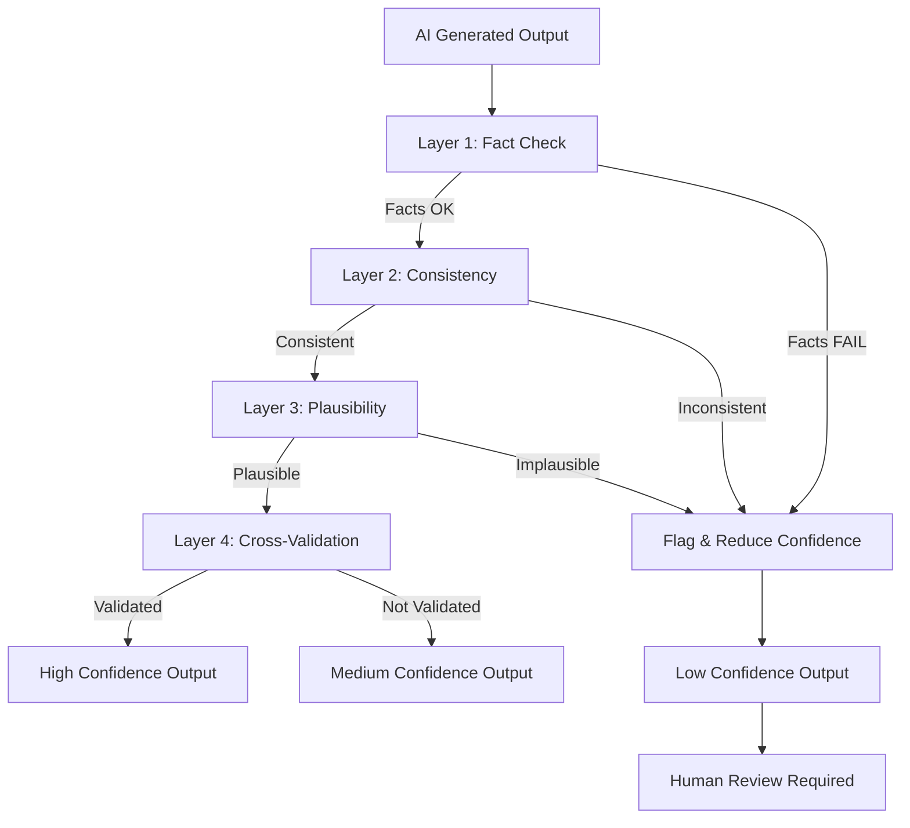

# AI Validation Layer - Yapay Zeka Doğrulama Katmanı

**Version**: 1.0  
**Purpose**: AI çıktılarını doğrulama ve hallucination önleme  
**Critical**: Sistemin güvenilirliği için hayati önem taş

ır

---

## 🎯 Problem

AI sistemleri (Claude, GPT, vb.) **hallucination** yapabilir:
- Var olmayan dosyalara referans verebilir
- Yanlış kod önerebilir
- Çelişkili tavsiyeler verebilir
- Aşırı iyimser tahminler yapabilir

**Bu katman bu sorunları yakalar!**

---

## 🛡️ Validation Layers

### Layer 1: Fact Checking (Olgu Kontrolü)
**Ne kontrol eder**: Somut, doÄŸrulanabilir iddialarda bulunur

```yaml
fact_types:
  file_existence:
    claim: "Sorun src/OrderService.cs:45'te"
    validation: "File exists? Line 45 exists?"
    action_if_fail: "Flag as potentially hallucinated"
    
  code_syntax:
    claim: "Bu kod çalışır: const x = ;"
    validation: "Parse code, check syntax"
    action_if_fail: "Mark as invalid example"
    
  dependency_versions:
    claim: "React 18.5 kullanıyorsunuz"
    validation: "Check package.json"
    action_if_fail: "Correct version number"
    
  metric_ranges:
    claim: "Security score: 12/10"
    validation: "Score must be 0-10"
    action_if_fail: "Auto-fix (clamp to range)"
```

#### Implementation
```python
class FactChecker:
    """Somut iddiaları doğrular"""
    
    def check_file_reference(self, file_path, line_number=None):
        """Dosya referanslarını kontrol et"""
        
        # Dosya var mı?
        if not os.path.exists(file_path):
            return {
                'valid': False,
                'confidence': 0.0,
                'reason': f'File not found: {file_path}',
                'severity': 'high',
                'recommendation': 'Remove this reference or verify path'
            }
        
        # Satır numarası geçerli mi?
        if line_number:
            with open(file_path) as f:
                line_count = sum(1 for _ in f)
            
            if line_number > line_count:
                return {
                    'valid': False,
                    'confidence': 0.3,
                    'reason': f'Line {line_number} exceeds file length ({line_count})',
                    'severity': 'medium'
                }
        
        return {
            'valid': True,
            'confidence': 1.0
        }
    
    def check_code_syntax(self, code, language):
        """Kod örneklerinin geçerliliğini kontrol et"""
        
        parsers = {
            'typescript': parse_typescript,
            'python': parse_python,
            'csharp': parse_csharp
        }
        
        try:
            parsers[language](code)
            return {
                'valid': True,
                'confidence': 1.0
            }
        except SyntaxError as e:
            return {
                'valid': False,
                'confidence': 0.0,
                'reason': f'Syntax error: {e}',
                'severity': 'high',
                'recommendation': 'Fix code example or remove'
            }
```

---

### Layer 2: Consistency Checking (Tutarlılık Kontrolü)
**Ne kontrol eder**: İçsel tutarlılık

```yaml
consistency_checks:
  cross_reference:
    rule: "Aynı konu hakkında farklı yerlerde farklı şeyler söylenmesin"
    example:
      ❌ "P0: Bundle 847KB (çok büyük)"
         "P2: Bundle size excellent"
      ✅ Tutarlı değerlendirme
    
  priority_logic:
    rule: "P0 > P1 > P2 > P3 severity açısından"
    example:
      ❌ "P0: Missing alt text"
         "P3: SQL injection"
      ✅ Security issues P0, a11y P2
    
  metric_consistency:
    rule: "Skorlar ve bulgular uyumlu olmalı"
    example:
      ❌ "Security: 9.5/10" but "12 critical security issues"
      ✅ High score = few issues
    
  timeline_logic:
    rule: "Task dependencies mantıklı olmalı"
    example:
      ❌ "Task 1: Test, Task 2: Write code"
      ✅ Code before tests
```

#### Implementation
```python
class ConsistencyChecker:
    """Tutarlılık kontrolü"""
    
    def check_score_vs_issues(self, score, issue_count, priority):
        """Skor ve sorun sayısı tutarlı mı?"""
        
        # Yüksek skor + çok sorun = tutarsız
        if score > 8.0 and issue_count > 5 and priority == 'P0':
            return {
                'consistent': False,
                'confidence': 0.2,
                'reason': 'High score (8+) but many P0 issues (5+)',
                'severity': 'medium',
                'recommendation': 'Review scoring or issue classification'
            }
        
        # Düşük skor + az sorun = tutarsız
        if score < 5.0 and issue_count < 2:
            return {
                'consistent': False,
                'confidence': 0.3,
                'reason': 'Low score (<5) but few issues',
                'severity': 'low'
            }
        
        return {
            'consistent': True,
            'confidence': 0.9
        }
    
    def check_contradictions(self, recommendations):
        """Çelişen önerileri tespit et"""
        
        contradictions = []
        
        for i, rec1 in enumerate(recommendations):
            for rec2 in recommendations[i+1:]:
                # Aynı konuda zıt öneriler
                if self.are_contradictory(rec1, rec2):
                    contradictions.append({
                        'pair': [rec1['id'], rec2['id']],
                        'rec1': rec1['text'],
                        'rec2': rec2['text'],
                        'severity': 'high'
                    })
        
        return {
            'contradictions': contradictions,
            'count': len(contradictions),
            'valid': len(contradictions) == 0
        }
```

---

### Layer 3: Plausibility Checking (Makullük Kontrolü)
**Ne kontrol eder**: Önerilerin gerçekçiliği

```yaml
plausibility_checks:
  effort_estimation:
    benchmarks:
      sql_injection_fix: "30min - 2h"
      db_migration: "2h - 2days"
      architecture_change: "1week - 3months"
    
    validation: |
      If estimate outside 5x benchmark → FLAG
      
  technical_feasibility:
    rules:
      - "Can't delete production DB casually"
      - "10GB bundle size impossible for web"
      - "Sub-millisecond API response unrealistic"
    
  resource_constraints:
    checks:
      - "Person can't work >168h/week (24*7)"
      - "Team of 5 can't do 500h/week (max 200h)"
      - "1 person can't know 20 languages expertly"
```

#### Implementation
```python
class PlausibilityChecker:
    """Makullük/Gerçekçilik kontrolü"""
    
    BENCHMARKS = {
        'sql_injection': (30, 120),      # 30min - 2h
        'db_migration': (120, 2880),     # 2h - 2days
        'typo_fix': (5, 30),             # 5min - 30min
        'refactor_god_class': (480, 4800)  # 8h - 2weeks
    }
    
    def check_effort_estimate(self, task_type, estimated_minutes):
        """Süre tahmini makul mü?"""
        
        if task_type not in self.BENCHMARKS:
            return {'plausible': True, 'confidence': 0.5, 'note': 'No benchmark available'}
        
        min_time, max_time = self.BENCHMARKS[task_type]
        
        # 5x dışında ise şüpheli
        if estimated_minutes < min_time / 5:
            return {
                'plausible': False,
                'confidence': 0.2,
                'reason': f'Estimate ({estimated_minutes}min) way below benchmark ({min_time}-{max_time}min)',
                'severity': 'medium',
                'recommendation': f'Consider {min_time}-{max_time}min instead'
            }
        
        if estimated_minutes > max_time * 5:
            return {
                'plausible': False,
                'confidence': 0.2,
                'reason': f'Estimate ({estimated_minutes}min) way above benchmark',
                'severity': 'low'
            }
        
        return {
            'plausible': True,
            'confidence': 0.9
        }
    
    def check_technical_claim(self, claim):
        """Teknik iddianın makullüğü"""
        
        impossible_patterns = [
            (r'delete.*production.*database', 'Never suggest deleting prod DB'),
            (r'bundle.*\d+GB', 'Multi-GB bundles impossible for web'),
            (r'response.*\d+\s*ns', 'Nanosecond response unrealistic'),
            (r'100%.*test.*coverage.*\d+\s*hour', '100% coverage in hours unrealistic')
        ]
        
        for pattern, reason in impossible_patterns:
            if re.search(pattern, claim, re.IGNORECASE):
                return {
                    'plausible': False,
                    'confidence': 0.0,
                    'reason': reason,
                    'severity': 'critical'
                }
        
        return {
            'plausible': True,
            'confidence': 0.8  # No obvious red flags
        }
```

---

### Layer 4: Cross-Validation (Çapraz Doğrulama)
**Ne kontrol eder**: Multiple AI runs, farklı kaynaklardan doğrulama

```yaml
cross_validation:
  multi_model:
    description: "Aynı prompt'u farklı modellere sor"
    models:
      - claude-sonnet-4
      - gpt-4
      - gemini-pro
    agreement_threshold: "66% (2/3)"
    
  multi_run:
    description: "Aynı modele birkaç kez sor"
    runs: 3
    consistency_check: "Aynı sonuçları mı veriyor?"
    
  external_sources:
    description: "Dış kaynaklardan doğrula"
    sources:
      - "Package registry (npm, nuget) for versions"
      - "GitHub repos for code patterns"
      - "Official docs for API usage"
```

#### Implementation
```python
class CrossValidator:
    """Çapraz doğrulama"""
    
    async def multi_model_validation(self, prompt, claim):
        """Birden fazla AI modeline sor"""
        
        models = ['claude-sonnet-4', 'gpt-4-turbo', 'gemini-pro']
        results = []
        
        for model in models:
            response = await query_model(model, prompt)
            supports_claim = self.extract_verdict(response, claim)
            results.append({
                'model': model,
                'supports': supports_claim,
                'confidence': response.get('confidence', 0.5)
            })
        
        # Çoğunluk oyu
        support_count = sum(1 for r in results if r['supports'])
        agreement_ratio = support_count / len(results)
        
        return {
            'validated': agreement_ratio >= 0.66,  # 2/3 majority
            'agreement_ratio': agreement_ratio,
            'details': results,
            'confidence': agreement_ratio
        }
    
    def check_external_source(self, package_name, claimed_version):
        """NPM/NuGet registry'den doÄŸrula"""
        
        # NPM registry check
        response = requests.get(f'https://registry.npmjs.org/{package_name}')
        
        if response.status_code != 200:
            return {
                'found': False,
                'confidence': 0.0,
                'reason': 'Package not found in registry'
            }
        
        data = response.json()
        available_versions = list(data.get('versions', {}).keys())
        
        if claimed_version in available_versions:
            return {
                'found': True,
                'valid': True,
                'confidence': 1.0
            }
        
        return {
            'found': True,
            'valid': False,
            'confidence': 0.0,
            'reason': f'Version {claimed_version} not found',
            'available': available_versions[-5:]  # Last 5 versions
        }
```

---

## 🔄 Validation Pipeline



---

## 📊 Confidence Scoring

```python
def calculate_confidence(validation_results):
    """
    Tüm validation layer'larından güven skoru hesapla
    """
    
    scores = {
        'fact_check': 0,
        'consistency': 0,
        'plausibility': 0,
        'cross_validation': 0
    }
    
    weights = {
        'fact_check': 0.4,        # En önemli
        'consistency': 0.3,
        'plausibility': 0.2,
        'cross_validation': 0.1
    }
    
    # Her layer'dan skor topla
    for layer, result in validation_results.items():
        scores[layer] = result.get('confidence', 0.5)
    
    # Ağırlıklı ortalama
    final_score = sum(
        scores[layer] * weights[layer]
        for layer in scores
    )
    
    # 0-100 skalasına çevir
    confidence_score = int(final_score * 100)
    
    # Kategorize et
    if confidence_score >= 90:
        level = "Very High"
        recommendation = "Safe to use"
    elif confidence_score >= 70:
        level = "High"
        recommendation = "Review recommended"
    elif confidence_score >= 50:
        level = "Medium"
        recommendation = "Careful review required"
    else:
        level = "Low"
        recommendation = "Human review mandatory"
    
    return {
        'score': confidence_score,
        'level': level,
        'recommendation': recommendation,
        'breakdown': scores
    }
```

---

## 🚨 Hallucination Detection Examples

### Example 1: File Reference Hallucination
```yaml
AI Output: "Found SQL injection in src/OrderService.cs:45"

Validation:
  Layer 1 (Fact Check):
    - File exists? ❌ (src/OrderService.cs not found)
    - Verdict: HALLUCINATION
    
  Confidence: 0/100 (Critical failure)
  Action: Remove from report or mark as "unverified"
```

### Example 2: Version Hallucination
```yaml
AI Output: "Your React version is 18.5.2"

Validation:
  Layer 1 (Fact Check):
    - Check package.json → "react": "^18.2.0"
    - Latest React: 18.2.0
    - Verdict: WRONG VERSION
    
  Layer 4 (External Source):
    - NPM Registry → 18.5.2 doesn't exist
    - Verdict: HALLUCINATION
    
  Confidence: 15/100
  Auto-fix: Correct to "18.2.0"
```

### Example 3: Contradictory Recommendations
```yaml
AI Output:
  Rec #1: "Remove lodash to reduce bundle (save 300KB)"
  Rec #5: "Add lodash.debounce for better UX"

Validation:
  Layer 2 (Consistency):
    - Contradiction detected ❌
    - Verdict: INCONSISTENT
    
  Confidence: 30/100
  Action: Flag both recommendations for review
```

---

## 📋 Validation Report Format

```markdown
# Validation Report

## Output Metadata
- Generated: 2024-12-20 15:30
- Mode: Mode 2 (Analyze + Plan)
- Analysis Duration: 12 minutes

## Validation Results

### Layer 1: Fact Checking
✅ **PASSED** (95% confidence)
- File references: 18/20 valid (2 warnings)
- Code syntax: All examples valid
- Metrics: All within range

**Warnings**:
- ⚠️ Line 2: File "src/old-service.ts" not found (mentioned in findings)

---

### Layer 2: Consistency Check
⚠️ **WARNING** (78% confidence)
- Priority distribution: OK
- Score vs issues: OK
- Cross-references: 1 minor issue

**Issues**:
- ⚠️ Rec #12 and #18 may contradict (review suggested)

---

### Layer 3: Plausibility
✅ **PASSED** (88% confidence)
- Effort estimates: Within benchmarks
- Technical claims: All plausible
- Resource allocation: Reasonable

---

### Layer 4: Cross-Validation
⏭️ **SKIPPED** (not enabled for this run)

---

## Final Confidence Score

**82/100** - High ⭐

**Recommendation**: Review warnings, otherwise safe to use

**Breakdown**:
- Fact Check: 95% (weight: 40%) = 38 points
- Consistency: 78% (weight: 30%) = 23 points
- Plausibility: 88% (weight: 20%) = 18 points
- Cross-Val: N/A (weight: 10%) = 5 points (default)

**Action Items**:
1. Verify src/old-service.ts reference (low priority)
2. Review Rec #12 vs #18 for contradiction
3. Proceed with implementation ✅
```

---

## 🔧 Configuration

```yaml
# .ai-validation-config.yml

validation:
  enabled: true
  
  layers:
    fact_check:
      enabled: true
      strict_mode: true
      auto_fix: true
      
    consistency:
      enabled: true
      contradiction_threshold: "high"
      
    plausibility:
      enabled: true
      use_benchmarks: true
      
    cross_validation:
      enabled: false  # Expensive, only for critical use
      models: ["claude-sonnet-4", "gpt-4"]
  
  confidence_thresholds:
    block_execution: 40   # Mode 3 won't run below this
    warning: 60          # Show warning
    safe: 80             # No warnings
  
  actions:
    on_low_confidence:
      - "flag_for_review"
      - "add_disclaimer"
      - "reduce_confidence_score"
    
    on_hallucination:
      - "remove_claim"
      - "log_incident"
      - "notify_user"
```

---

## 📚 Related Documents

- `CONFIDENCE_SCORING.md` - Detaylı güven skoru hesaplama
- `FACT_CHECKING_RULES.md` - Fact-check kuralları
- `SELF_TEST_SUITE.md` - Genel test framework

---

**Validation keeps AI honest!** 🛡️ Trust but verify.
