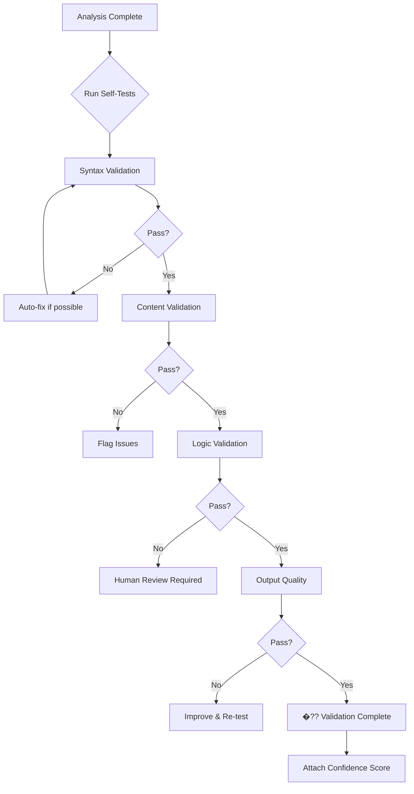

# Self-Test Suite - Sistem Kendi Do�?rulama Mekanizması

**Version**: 1.0  
**Purpose**: AI Analysis System'in kendi çıktılarını do�?rulaması  
**Priority**: P0 (Güvenilirlik için kritik)

---

## �??� Amaç

Bu framework, sistemin üretti�?i analizlerin, önerilerin ve planların **otomatik olarak do�?rulanmasını** sa�?lar. AI hallucination riskini azaltır ve çıktı kalitesini garanti eder.

---

## �??? Test Kategorileri

### 1. Syntax Validation (Sözdizimi Kontrolü)
**Ne kontrol eder**: �?retilen dosyaların format do�?rulu�?u

```yaml
test_syntax_validation:
  name: "Markdown syntax kontrolü"
  
  checks:
    - valid_markdown: true
      reason: "Tüm ba�?lıklar # ile ba�?lamalı"
      
    - code_blocks_closed: true
      reason: "Açılan ``` kapatılmalı"
      
    - table_syntax: true
      reason: "Tablolar do�?ru formatlanmalı"
      
    - yaml_valid: true
      reason: "YAML blokları parse edilebilir olmalı"
  
  auto_fix: true
  severity: "medium"
```

**�?rnek Test**:
```python
def test_markdown_syntax(output_file):
    """Markdown dosyasının geçerli oldu�?unu kontrol et"""
    
    with open(output_file) as f:
        content = f.read()
    
    # Test 1: Her ``` açılı�?ının kapanı�?ı var mı?
    code_blocks = content.count("```")
    assert code_blocks % 2 == 0, "Açık code block var!"
    
    # Test 2: Ba�?lıklar # ile mi ba�?lıyor?
    lines = content.split('\n')
    for line in lines:
        if line.startswith('#'):
            assert line[1] == ' ' or line[1] == '#', "Ba�?lık formatı hatalı"
    
    return "PASS"
```

---

### 2. Content Validation (İçerik Do�?rulama)
**Ne kontrol eder**: Analizin içeri�?inin mantıklı olması

```yaml
test_content_validation:
  name: "İçerik tutarlılı�?ı kontrolü"
  
  checks:
    - priority_consistency:
        rule: "P0 sorunlar P1'den fazla olmalı (severity)"
        example: "P0: 3 sorun, P1: 15 sorun �?? UYARI"
    
    - score_range:
        rule: "Skorlar 0-10 arasında olmalı"
        example: "Security: 12/10 �?? HATA"
    
    - file_references:
        rule: "Referans verilen dosyalar mevcut olmalı"
        example: "src/missing.ts:45 �?? Dosya yok �?? UYARI"
    
    - recommendation_feasibility:
        rule: "�?neriler uygulanabilir olmalı"
        example: "Delete production DB �?? RİSKLİ �?? FLAG"
  
  auto_fix: false
  severity: "high"
```

**�?rnek Test**:
```python
def test_priority_consistency(analysis_json):
    """P0 sorunların gerçekten kritik oldu�?unu kontrol et"""
    
    p0_issues = analysis_json['findings']['P0']
    p1_issues = analysis_json['findings']['P1']
    
    # Test: P0'da 10+ sorun varsa �?üpheli
    if len(p0_issues) > 10:
        return {
            "status": "WARNING",
            "message": "10+ P0 sorun nadir, priority inflation olabilir"
        }
    
    # Test: P0'ların hepsi security/performance ile ilgili mi?
    critical_tags = ['security', 'data-loss', 'performance-critical']
    for issue in p0_issues:
        if not any(tag in issue['tags'] for tag in critical_tags):
            return {
                "status": "FAIL",
                "message": f"P0 issue '{issue['title']}' kritik de�?il"
            }
    
    return {"status": "PASS"}
```

---

### 3. Logic Validation (Mantık Kontrolü)
**Ne kontrol eder**: �?nerilerin mantıksal tutarlılı�?ı

```yaml
test_logic_validation:
  name: "Mantık tutarlılı�?ı"
  
  checks:
    - contradiction_detection:
        rule: "�?eli�?en öneriler olmamalı"
        example: "Sorun: 'Bundle çok büyük' + �?neri: 'Daha fazla library ekle' �?? �?ELİ�?Kİ"
    
    - dependency_order:
        rule: "Ba�?ımlı tasklar do�?ru sırada"
        example: "Task 3: 'Test yaz' BEFORE Task 1: 'Kodu düzelt' �?? YANLI�? SIRA"
    
    - effort_estimation:
        rule: "Süre tahminleri gerçekçi"
        example: "'Database migration: 5 minutes' �?? �?�?PHELİ"
    
    - resource_allocation:
        rule: "Aynı ki�?iye çok i�? verilmemi�?"
        example: "Ali: 80 saat/hafta �?? İMKANSIZ"
  
  auto_fix: false
  severity: "high"
```

**�?rnek Test**:
```python
def test_contradiction_detection(recommendations):
    """�?eli�?en önerileri tespit et"""
    
    contradictions = []
    
    for i, rec1 in enumerate(recommendations):
        for rec2 in recommendations[i+1:]:
            # �?eli�?ki 1: Bundle küçült vs büyüt
            if ('reduce bundle' in rec1['text'].lower() and 
                'add library' in rec2['text'].lower()):
                contradictions.append({
                    "pair": [rec1['id'], rec2['id']],
                    "reason": "Bundle optimization vs library addition"
                })
            
            # �?eli�?ki 2: Aynı dosyada farklı de�?i�?iklikler
            if (rec1['file'] == rec2['file'] and 
                rec1['action'] == 'delete' and rec2['action'] == 'modify'):
                contradictions.append({
                    "pair": [rec1['id'], rec2['id']],
                    "reason": "Cannot modify deleted file"
                })
    
    if contradictions:
        return {"status": "FAIL", "contradictions": contradictions}
    
    return {"status": "PASS"}
```

---

### 4. Output Quality (�?ıktı Kalitesi)
**Ne kontrol eder**: Raporun okunabilirli�?i ve faydalılı�?ı

```yaml
test_output_quality:
  name: "Rapor kalitesi"
  
  checks:
    - language_consistency:
        rule: "Tüm rapor Türkçe olmalı (e�?er belirtilmi�?se)"
        check: "İngilizce kelime oranı < %10"
    
    - actionable_recommendations:
        rule: "Her öneri somut adımlar içermeli"
        bad_example: "Performansı artır" �?
        good_example: "Bundle size'ı 847KB'dan 320KB'a dü�?ür: lodash �?? lodash-es" �??
    
    - code_examples:
        rule: "�?nemli öneriler kod örne�?i içermeli"
        threshold: "P0 ve P1 sorunların %80+i"
    
    - readability_score:
        rule: "Flesch reading ease > 60 (kolay okunur)"
        tool: "textstat.flesch_reading_ease()"
  
  auto_fix: true
  severity: "medium"
```

**�?rnek Test**:
```python
def test_actionable_recommendations(recommendations):
    """�?nerilerin somut olup olmadı�?ını kontrol et"""
    
    vague_keywords = [
        'improve', 'optimize', 'enhance', 'better',
        'geli�?tir', 'iyile�?tir', 'düzelt', 'yap'
    ]
    
    actionable_count = 0
    vague_recs = []
    
    for rec in recommendations:
        text = rec['text'].lower()
        
        # Somutluk kontrolleri
        has_numbers = any(char.isdigit() for char in text)
        has_file_ref = 'src/' in text or '.ts' in text
        has_code = 'code' in rec and len(rec['code']) > 0
        
        # Vague kelimeler var ama somut bilgi yok
        if (any(kw in text for kw in vague_keywords) and 
            not (has_numbers or has_file_ref or has_code)):
            vague_recs.append(rec['id'])
        else:
            actionable_count += 1
    
    ratio = actionable_count / len(recommendations)
    
    return {
        "status": "PASS" if ratio > 0.8 else "FAIL",
        "actionable_ratio": f"{ratio*100:.1f}%",
        "vague_recommendations": vague_recs
    }
```

---

## �??? Test Execution Flow



---

## �??? Confidence Scoring

Her analiz bir **güven skoru** alır:

```yaml
confidence_score:
  calculation: |
    base_score = 100
    
    # Deductions
    - syntax_errors: -5 per error
    - content_warnings: -10 per warning
    - logic_failures: -20 per failure
    - quality_issues: -5 per issue
    
    # Bonuses
    + all_tests_pass: +10
    + has_code_examples: +5
    + references_real_files: +5
  
  interpretation:
    90-100: "�?ok Yüksek - Güvenle kullanılabilir"
    70-89:  "Yüksek - İnceleme sonrası kullan"
    50-69:  "Orta - Dikkatle kullan"
    0-49:   "Dü�?ük - Manuel review gerekli"
```

**�?rnek �?ıktı**:
```markdown
## �??� Validation Results

�?? Syntax: PASS (0 errors)
�?? Content: PASS (2 warnings)
�?�️ Logic: WARNING (1 contradiction detected)
�?? Quality: PASS (readability: 72)

**Confidence Score**: 82/100 (Yüksek)

**Warnings**:
- Contradiction: Task 5 ve Task 8 aynı dosyayı de�?i�?tiriyor
- P0 issue count (12) normalden yüksek

**Recommendation**: İnceleme sonrası kullan �??
```

---

## �???️ Configuration

```yaml
# .ai-self-test.yml
self_test:
  enabled: true
  
  run_on:
    - after_analysis: true
    - before_mode3_execution: true
    - on_demand: true
  
  test_suites:
    syntax:
      enabled: true
      auto_fix: true
      
    content:
      enabled: true
      auto_fix: false
      
    logic:
      enabled: true
      auto_fix: false
      
    quality:
      enabled: true
      auto_fix: true
  
  thresholds:
    minimum_confidence: 70  # Mode 3 için
    warning_threshold: 50
    
  actions:
    if_fail_syntax: "auto_fix"
    if_fail_content: "warn_user"
    if_fail_logic: "block_mode3"
    if_fail_quality: "suggest_improvements"
```

---

## �??� Integration with Modes

### Mode 1 (Analyze)
```
Analysis �?? Self-Test �?? Confidence Score �?? Report
```
- Test fails �?? Raporda uyarı ekle
- Confidence score her zaman göster

### Mode 2 (Plan)
```
Analysis �?? Self-Test �?? Plan Generation �?? Plan Validation �?? Report
```
- Plan'da logic test önemli
- Dependency order kontrolü

### Mode 3 (Execute)
```
Analysis �?? Self-Test �?? Confidence Check �?? Execute (if >70)
```
- **BLOCKER**: Confidence <70 ise Mode 3 çalı�?maz
- User override seçene�?i

---

## �?? Example: Full Test Run

```bash
# Self-test çalı�?tırma
$ ai-analysis self-test analysis-report.md

Running Self-Test Suite v1.0...

[1/4] Syntax Validation
  �?? Markdown syntax: PASS
  �?? Code blocks: PASS
  �?? YAML blocks: PASS
  �?? Table format: PASS
  
[2/4] Content Validation
  �?? Priority consistency: PASS
  �?? Score ranges: PASS
  �?�️  File references: 2 warnings
      - src/old-file.ts not found (mentioned in line 45)
  �?? Recommendations: PASS

[3/4] Logic Validation
  �?? No contradictions: PASS
  �?? Dependency order: PASS
  �?�️  Effort estimation: 1 warning
      - "Database migration: 30 min" might be underestimated
  �?? Resource allocation: PASS

[4/4] Output Quality
  �?? Language (Turkish): PASS (96% TR)
  �?? Actionable recs: PASS (87%)
  �?? Code examples: PASS (P0: 100%, P1: 80%)
  �?? Readability: PASS (score: 68)

�?��?��?��?��?��?��?��?��?��?��?��?��?��?��?��?��?��?��?��?��?��?��?��?��?��?��?��?��?��?��?��?��?��?��?��?��?��?��?��?�

�??? FINAL RESULTS

Tests Run: 16
Passed: 14
Warnings: 2
Failures: 0

Confidence Score: 88/100 ⭐ (Yüksek)

Recommendation: �?? Güvenle kullanılabilir
(Warnings gözden geçirilebilir ama bloke edici de�?il)

�?��?��?��?��?��?��?��?��?��?��?��?��?��?��?��?��?��?��?��?��?��?��?��?��?��?��?��?��?��?��?��?��?��?��?��?��?��?��?��?�
```

---

## �??� Extending Tests

Yeni test eklemek için:

```python
# custom_tests.py

from self_test_suite import TestCase

class CustomTest(TestCase):
    """�?zel test senaryosu"""
    
    name = "My Custom Check"
    severity = "medium"
    
    def run(self, analysis_data):
        # Test logic burada
        if some_condition:
            return self.PASS()
        else:
            return self.FAIL("Reason here")
```

Sonra config'e ekle:
```yaml
custom_tests:
  - name: "CustomTest"
    enabled: true
    auto_fix: false
```

---

## �??? Related Documents

- `VALIDATION_RULES.md` - Detaylı validation kuralları
- `TEST_SCENARIOS.md` - �?rnek test senaryoları
- `REGRESSION_TESTS.md` - Regresyon test suite'i
- `CONFIDENCE_SCORING.md` - Güven skoru hesaplama

---

**�?nemli**: Self-testing sistemi %100 hatasızlık garantisi vermez, ama **risk seviyesini ölçer** ve **�?effaflık sa�?lar**. AI'a güven + do�?rulama = güçlü sistem! �??�️
