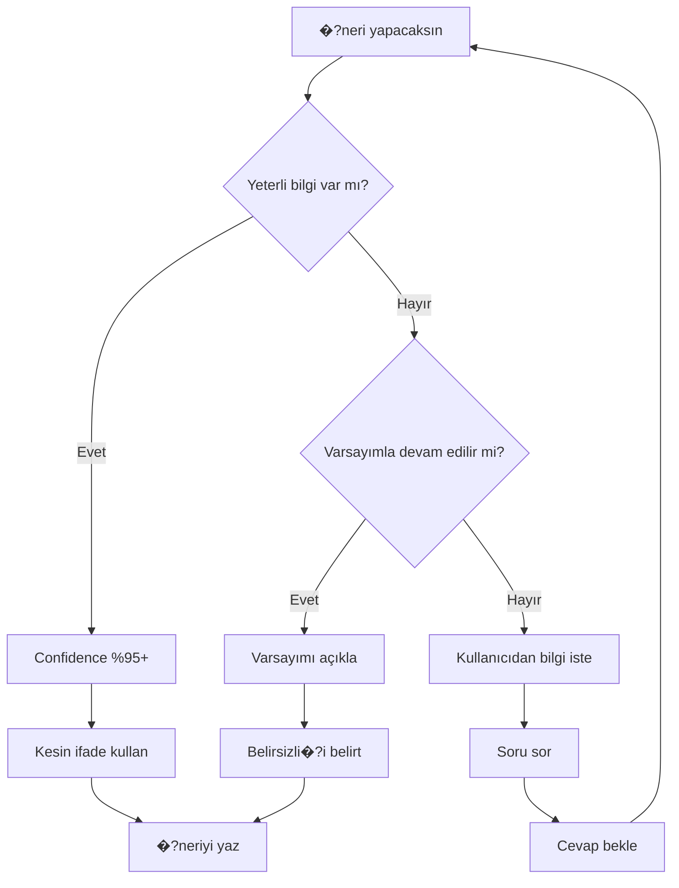

# Uncertainty Handling - Belirsizlik Yönetimi

**Module**: AI Validation Layer  
**Priority**: P0 (Critical)  
**Version**: 1.0  
**Last Updated**: 20 Aralık 2024

---

## �??� Amaç

AI sisteminin **ne bilmedi�?ini bilmesi** ve belirsizli�?i açıkça ifade etmesi. Hallucination'ın ço�?u, sistemin emin olmadı�?ı �?eylerde a�?ırı güvenli konu�?masından gelir.

**Prensip**: "Bilmiyorum" demek, yanlı�? bilgi vermekten iyidir.

---

## �??? Belirsizlik Seviyeleri

### Level 1: Kesin Bilgi �??
```yaml
confidence: 95-100%
indicator: "Kesin olarak tespit edildi"
action: Direct statement
example: "SQL injection güvenlik açı�?ı var (OrderService.cs:45)"
```

### Level 2: Yüksek Olasılık �??�
```yaml
confidence: 75-94%
indicator: "Büyük olasılıkla"
action: State with caveat
example: "N+1 query sorunu olabilir (eager loading eksik görünüyor)"
```

### Level 3: Orta Belirsizlik �??�
```yaml
confidence: 50-74%
indicator: "Potansiyel olarak"
action: Suggest investigation
example: "Bundle size yüksek olabilir, production build'ini analiz etmek gerekir"
```

### Level 4: Dü�?ük Güven �??�
```yaml
confidence: 25-49%
indicator: "Tam emin de�?ilim ama"
action: Mark as speculation
example: "God class pattern'i olabilir, ancak business domain analizi gerekli"
```

### Level 5: Bilinmiyor �?
```yaml
confidence: 0-24%
indicator: "Bu konuda yeterli bilgim yok"
action: Recommend expert consultation
example: "Performans hedefleriniz hakkında bilgi sahibi de�?ilim, belirtebilir misiniz?"
```

---

## �??� Belirsizlik Kaynakları

### 1. Eksik Ba�?lam
```markdown
�? Hatalı: "Bu API yava�?"
�?? Do�?ru: "Bu API 500ms'de cevap veriyor. Kabul edilebilir bir süre mi, 
           performans hedeflerinize ba�?lı - belirtebilir misiniz?"

Neden: "Yava�?" subjektif, hedef SLA bilinmiyor
Belirsizlik: High
Aksiyon: Kullanıcıdan context iste
```

### 2. Görünmez Faktörler
```markdown
�? Hatalı: "Test coverage %78, bu yeterli"
�?? Do�?ru: "Test coverage %78. Industry standard %80, ancak critical 
           path'leriniz hangileri bilmiyorum - bunlar test edilmi�?se yeterli olabilir"

Neden: Hangi kod kritik bilinmiyor
Belirsizlik: Medium
Aksiyon: Qualify the statement
```

### 3. Teknik Sınırlamalar
```markdown
�? Hatalı: "Database migration sorunsuz çalı�?ır"
�?? Do�?ru: "Migration script do�?ru görünüyor ANCAK production data 
           hacmini bilmiyorum. Büyük tablolarda lock riski olabilir - 
           önce staging'de test edilmeli"

Neden: Production scale bilinmiyor
Belirsizlik: High
Aksiyon: Risk disclaimer + recommendation
```

### 4. Domain Bilgisi Eksikli�?i
```markdown
�? Hatalı: "Bu fonksiyon gereksiz, silin"
�?? Do�?ru: "Bu fonksiyon görünürde kullanılmıyor, ancak business logic'i 
           tam bilmiyorum. Gerçekten gereksizse silinebilir - domain 
           expert'e danı�?ın"

Neden: Business context eksik
Belirsizlik: Very High
Aksiyon: Recommend domain expert review
```

---

## �??� İfade �?ablonları

### Kesin Bulgu
```
"[SORUN] tespit edildi"
"Kesin olarak [X] durumu var"
"[METRIC] ölçüldü: [VALUE]"
```

### Yüksek Olasılık
```
"Büyük olasılıkla [SORUN]"
"[X] pattern'i görünüyor"
"[Y] olması muhtemel"
```

### Orta Belirsizlik
```
"Potansiyel olarak [SORUN]"
"[X] olabilir"
"Daha fazla analiz gerekli: [Y]"
```

### Dü�?ük Güven
```
"Tam emin de�?ilim ama [X] olabilir"
"[Y] hakkında yeterli bilgi yok"
"[Z]'yi varsayıyorum, do�?ru mu?"
```

### Bilinmiyor
```
"Bu konuda bilgim yok"
"[X] hakkında veri eksik"
"Domain expert danı�?manızı öneririm"
```

---

## �??� Kontrol Listesi: Her �?neri İçin

Bir öneri yapmadan önce:

- [ ] **Kanıt var mı?** (kod, metrik, log)
- [ ] **Ba�?lam yeterli mi?** (business context, requirements)
- [ ] **Varsayımlar neler?** (açıkça belirt)
- [ ] **Confidence level nedir?** (0-100%)
- [ ] **Yanlı�?sam etkisi ne?** (risk assessment)

E�?er 5'inden biri net de�?ilse �?? **Belirsizli�?i belirt**

---

## �??� Anti-Patterns (YAPMA!)

### �? Anti-Pattern 1: A�?ırı Güvenlenen Tahmin
```markdown
BAD: "Bu god class, mutlaka 3 ayrı class'a bölün"

GOOD: "Bu class 800+ satır ve 15 farklı sorumluluk var. 
       Tipik god class pattern'i. ANCAK domain logic'i bilmiyorum -
       nasıl bölünece�?i business context'e ba�?lı. 
       Domain expert ile beraber refactor planı yapılmalı."
```

### �? Anti-Pattern 2: Belirsizli�?i Gizleme
```markdown
BAD: "Performans sorunları var" (hangi metrik, ne kadar kötü, kabul edilebilir mi?)

GOOD: "LCP 4.2s (hedef <2.5s için yava�?). Ancak sizin performans 
       SLA'nızı bilmiyorum - bu kabul edilebilir mi belirtin lütfen."
```

### �? Anti-Pattern 3: Varsayımları Gizli Tutma
```markdown
BAD: "Database index ekleyin"

GOOD: "Orders tablosunda CustomerId'ye index yok, bu N+1 soruna yol açabilir.
       ANCAK tablo boyutunu bilmiyorum - büyük tabloda (>10M rows) CONCURRENT 
       index gerekir, küçük tabloda direkt eklenebilir."
```

### �? Anti-Pattern 4: Binary Cevap Zorla
```markdown
BAD: "Bu kod kötü, yeniden yazın"

GOOD: "Bu kod �?u problemleri içeriyor: [liste]
       Yeniden yazmak mı yoksa refactor mu daha iyi?
       Bu kod ne kadar kritik, team bandwidth'iniz ne kadar - bunlara ba�?lı."
```

---

## �??� Pratik �?rnekler

### �?rnek 1: Test Coverage
```markdown
�??? Analiz:
Test coverage: 78%

�? Kötü Rapor:
"Test coverage dü�?ük, %80'e çıkarın"

�?? İyi Rapor:
"Test coverage %78 (industry standard ~%80)
 
Belirsizlik: 
- Hangi kod kritik path, bilmiyorum
- Bu %78'in içinde kritik fonksiyonlar test edilmi�?se yeterli olabilir
- E�?er kritik kod test edilmemi�?se, %78 yanıltıcı olabilir

�?neri:
1. Critical path'leri belirleyin
2. Onların coverage'ını ayrıca ölçün
3. O %100 ise, genel %78 kabul edilebilir"
```

### �?rnek 2: API Performance
```markdown
�??? Analiz:
GET /api/orders �?? 450ms average

�? Kötü Rapor:
"API yava�?, optimize edin"

�?? İyi Rapor:
"GET /api/orders �?? 450ms average response time

Belirsizlik:
- Sizin SLA hedefleriniz nedir? (bilinmiyor)
- Bu endpoint ne kadar kritik? (bilinmiyor)
- N+1 query var gibi görünüyor (%75 confidence - profiling gerekli)

Context sorguları:
1. Kabul edilebilir response time nedir?
2. Bu endpoint günde kaç kere ça�?rılıyor?
3. Kritik kullanıcı flow'unda mı?

E�?er:
- SLA <200ms ise �?? Kritik problem �?? Mutlaka fix
- SLA <1s ise �?? İyile�?tirilebilir �??� P2
- Nadiren kullanılıyor ise �?? Dü�?ük öncelik �??� P3"
```

### �?rnek 3: Architecture Decision
```markdown
�??? Analiz:
Monolith structure (tek repo, 85K LOC)

�? Kötü Rapor:
"Microservices'e geçin"

�?? İyi Rapor:
"Mevcut: Monolith (85K LOC)

Belirsizlik:
- Team size? (bilinmiyor)
- Deployment frequency? (bilinmiyor)  
- Domain boundaries? (net de�?il)
- Ops expertise? (bilinmiyor)

Monolith�?�점:
- Tek deployment (basit)
- Tek codebase (kolay search)
- Local development (hızlı)

Microservices�?�점:
- Independent scaling
- Team autonomy
- Technology diversity

Karar için gerekli:
1. Team >20 ki�?i mi? �?? Microservices dü�?ünülebilir
2. Farklı scale ihtiyaçları var mı? �?? Microservices
3. Ops ekibi K8s deneyimli mi? �?? Yoksa monolith devam

�?nerim:
�?imdilik monolith içinde modularity artırın (hexagonal architecture),
gerekti�?inde extraction daha kolay olur"
```

---

## �??? Belirsizlik Azaltma Akı�?ı



---

## �??? Belirsizlik Metri�?i (Her Raporda)

```markdown
## �??� Rapor Güvenilirlik �?zeti

**Kesin Bulgular**: 15 öneri (confidence >90%)
**Yüksek Olasılık**: 8 öneri (confidence 75-90%)
**Varsayımlarla**: 4 öneri (confidence 50-75%)
**Belirsiz**: 2 öneri (daha fazla bilgi gerekli)

**Toplam Güvenilirlik**: 83% (weighted average)

**Varsayımlar listesi**:
1. Production SLA <500ms (belirtilmedi)
2. Critical path: Login �?? Dashboard (varsayım)
3. Team size <10 ki�?i (repository'den tahmin)
```

---

## �??? E�?itim: Belirsizli�?i Fark Et

### Quiz: Hangi ifade daha iyi?

**Soru 1**:
- A) "Bu kod kötü, yeniden yaz"
- B) "Bu kod �?u sorunları içeriyor: [X,Y,Z]. Business context'i bilmiyorum, yeniden yazmak mı refactor mu daha iyi domain expert'e sorun"

**Cevap**: B �?? (Belirsizlik açık, seçim kullanıcıda)

**Soru 2**:
- A) "Test coverage %78, yeterli"
- B) "Test coverage %78. Industry standard ~%80, ancak kritik path'leriniz test edilmi�?se kabul edilebilir"

**Cevap**: B �?? (Context eksikli�?i belirtilmi�?)

**Soru 3**:
- A) "API 450ms, yava�?"
- B) "API 450ms. SLA hedefleriniz nedir? <200ms ise kritik, <1s ise kabul edilebilir olabilir"

**Cevap**: B �?? (Subjektif yargı vermemi�?, context sormu�?)

---

## �??�️ Hallucination �?nleme Checklist

Bir rapor yazmadan önce:

### �?? Do (Yap)
- [ ] Kanıtı göster (dosya:satır, metrik, log)
- [ ] Varsayımları listele
- [ ] Confidence level belirt
- [ ] Alternative scenarios dü�?ün
- [ ] "Bilmiyorum" de (gerçekten bilmiyorsan)
- [ ] Kullanıcıdan eksik bilgiyi iste
- [ ] Risk seviyesini belirt

### �? Don't (Yapma)
- [ ] Kesin konu�? (emin de�?ilsen)
- [ ] Varsayımları gizle
- [ ] Binary choice zorla
- [ ] Domain expert olmadan mimari karar ver
- [ ] Subjektif ifadeler (yava�?, kötü, karma�?ık) - ölçülebilir metrikler kullan
- [ ] Speculation'ı fact gibi sun
- [ ] Worst-case'i default gibi göster

---

## �??� İfade Dönü�?ümleri

### Dönü�?üm 1: Kesin �?? Qualified
```
�?nce: "Bu güvenlik açı�?ı"
Sonra: "Bu SQL injection pattern'i güvenlik riski ta�?ıyor (parameterized query eksik)"
```

### Dönü�?üm 2: Subjektif �?? Objective
```
�?nce: "Kod karma�?ık"
Sonra: "Cyclomatic complexity 45 (threshold 10). Fonksiyon 280 satır (önerilen <50)"
```

### Dönü�?üm 3: Varsayım �?? Açık
```
�?nce: "Database migrasyonu kolay"
Sonra: "Migration script do�?ru görünüyor. Ancak production data hacmini bilmiyorum - 
        küçük tablolarda (<100K rows) sorunsuz, büyük tablolarda lock riski var"
```

### Dönü�?üm 4: Binary �?? Spectrum
```
�?nce: "Microservices'e geç"
Sonra: "Monolith vs Microservices tradeoff:
        - Team <10: Monolith devam
        - Team >20: Microservices dü�?ünülebilir
        - Sizin team size'ınız nedir?"
```

---

## �??� Ba�?arı Kriterleri

Belirsizlik yönetimi ba�?arılı ise:

### Metrikler
- [ ] Her raporda confidence distribution var
- [ ] Varsayımlar açıkça listeleniyor
- [ ] "Bilmiyorum" ifadeleri var (uygun yerlerde)
- [ ] Kullanıcı follow-up soruları soruyor (iyi i�?aret!)
- [ ] False positive rate dü�?ük (<5%)

### Kullanıcı Feedback
- [ ] "Rapor �?effaf"
- [ ] "Nerelerde emin olmadı�?ınız belli"
- [ ] "Kararı bana bırakıyorsunuz, iyi"
- [ ] "Overconfident de�?il"

### Anti-Metrik (Bunlar K�?T�?)
- [ ] %100 confidence everywhere (gerçekçi de�?il)
- [ ] Hiç "bilmiyorum" yok (tehlikeli)
- [ ] Tüm öneriler kesin (hallucination riski)
- [ ] Kullanıcı soru sormuyor (engagement dü�?ük)

---

## �??? Referanslar

### İlgili Modüller
- `CONFIDENCE_SCORING.md` - Skorlama sistemi
- `FACT_CHECKING_RULES.md` - Do�?rulama kuralları
- `AI_VALIDATION_LAYER.md` - Genel validation

### Best Practices
- Humble AI: "I don't know" is better than hallucination
- Transparent assumptions
- User empowerment (let them decide)
- Measurable over subjective

---

**�?zet**: Belirsizli�?i saklamak de�?il, açıkça ifade etmek güven olu�?turur. �??�

---

**Version**: 1.0  
**Next Review**: v3.3 release  
**Feedback**: Kullanıcı belirsizlik ifadelerini nasıl kar�?ılıyor, tracking yapılmalı
