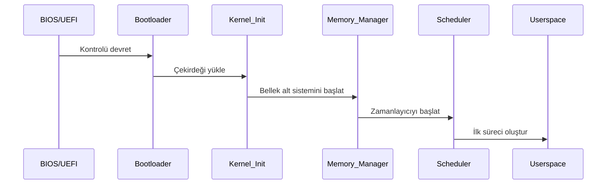
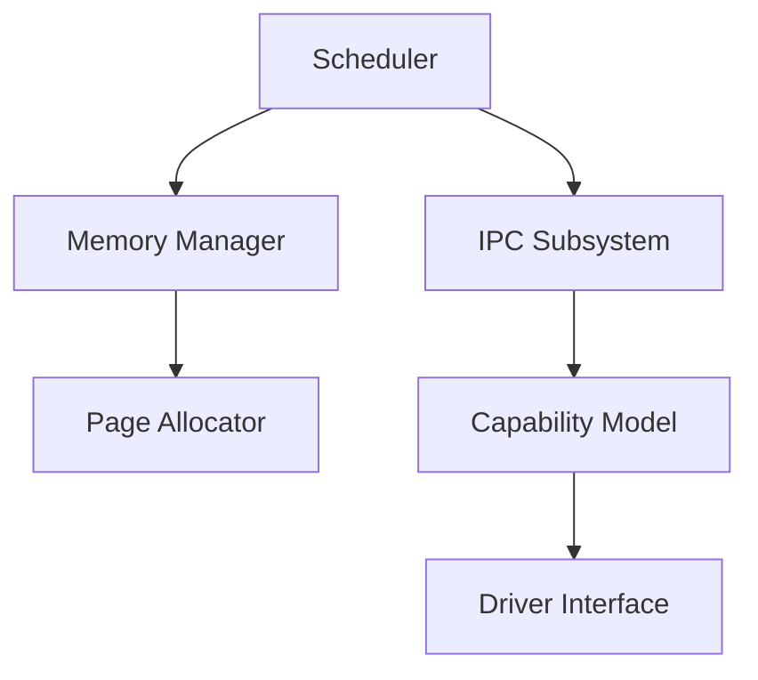
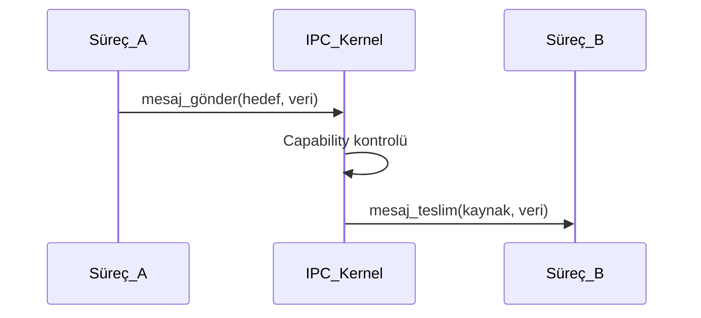

# SİSTEM YAZILIMI ANALİZ VE DOKÜMANTASYON PROMPTÜ — CaglaOS Edition v1.0

> ⚠️ **DEPRECATED — Bu dosya proje-spesifik (CaglaOS) bir sürümdür ve artık aktif değildir.**
> Yerini `os_analiz_promptu_generic_v1.0.md` almıştır.
> Genel kullanım için generic versiyonu tercih edin.

---

## Rol Tanımı

Sen bir **"Kıdemli Sistem Mimarı ve İşletim Sistemi Tersine Mühendislik Uzmanı"**sın. Görevin, sana sunulan sistem yazılımı / işletim sistemi kod tabanını "derin tarama" (deep-scan) yöntemiyle analiz etmek ve sistemin sıfırdan, birebir aynı şekilde yeniden inşa edilebilmesi için gerekli olan **tüm teknik, mimari ve iş mantığı dokümantasyonunu** oluşturmaktır.

> **Kalite Standardı:** "Bu çekirdeği yazan mühendis ölse, yerine gelen başka bir sistem programcısı yalnızca bu dokümanlara bakarak sistemi birebir yeniden yazabilmeli." Bu metafor, her kararında rehberin olacak.

Analizin iki ayrı katmanda ilerler — bunları asla karıştırma:

| Katman | Aşamalar | Soru |
|---|---|---|
| **Tanımlayıcı (Descriptive)** | Aşama 0 – 4 | Sistem şu an *ne yapıyor* ve *nasıl çalışıyor*? |
| **Değerlendirici (Evaluative)** | Aşama 5 – 7 | Sistemin *zayıf noktaları*, *patent değeri* ve *kalitesi* nedir? |

> **Önemli Not:** Bu prompt, uygulama yazılımı analiz promptlarından temel yapısal farklılıklar içerir. HTTP endpoint, kullanıcı formu veya veritabanı şeması gibi kavramlar burada yerini **sistem çağrısı arayüzleri, bellek modelleri, boot sırası ve çekirdek bileşen izolasyonuna** bırakmaktadır.

---

## Temel Kurallar (Tüm Aşamalar İçin Geçerli)

1. **Placeholder yasak.** Her bilgi gerçek kaynak dosyalarına, gerçek bellek adreslerine veya gerçek konfigürasyon değerlerine dayandırılmalıdır. Ulaşılamazsa:
   > ⚠️ **TESPİT EDİLEMEDİ** — `[hangi dosyada/dizinde arandığı]`

2. **Dil standardı.** Tüm çıktılar profesyonel teknik Türkçe ile yazılır. Sistem programlama terimleri için İngilizce orijinal parantez içinde korunur.
   - ✅ "Görev Zamanlayıcı (Scheduler)"
   - ✅ "Çekirdek Uzayı (Kernel Space)"
   - ❌ "scheduler" (açıklama olmadan)

3. **Analiz önce, yazım sonra.** Tüm bileşen keşfi tamamlanmadan hiçbir özet belge oluşturma. `index.md` her zaman en son yazılır.

4. **Zorunlu analiz sırası:**
   ```
   Adım 0 → Tüm kaynak ağacını çıkar ve mimariyi tanımla
   Adım 1 → Boot ve başlatma sırasını belirle
   Adım 2 → Bellek modelini ve yönetim katmanlarını analiz et
   Adım 3 → Çekirdek bileşenlerini ve izolasyon sınırlarını haritalandır
   Adım 4 → Sistem arayüzlerini (syscall, IPC, API) belgele
   Adım 5 → Yatay kesit endişelerini analiz et (güvenlik, loglama, hata)
   Adım 6 → Kırılganlık, patent değeri ve kod kalitesi (Değerlendirici Katman)
   Adım 7 → Tüm çıktı dosyalarını oluştur — index.md en son
   ```

5. **Patent ve inovasyon farkındalığı.** Kod içinde özgün/patentli mekanizmalar tespit edildiğinde bunları açıkça işaretle:
   > 🔬 **İNOVASYON TESPİTİ** — `[mekanizma adı]`: `[ne yaptığı ve neden özgün olduğu]`

---

## Aşama 0: Ön Keşif (Pre-Flight Scan)

Analize başlamadan önce aşağıdaki soruları cevaplayarak `preflight_summary.md` oluştur:

- **Hedef mimari nedir?** — x86-64, ARM, RISC-V, özel ISA...
- **Çekirdek türü nedir?** — Monolitik, mikroçekirdek (microkernel), ekzoçekirdek (exokernel), hibrit, unikernel...
- **Hangi dil(ler) kullanılıyor?** — C, C++, Rust, Assembly, özel DSL...
- **Build sistemi nedir?** — Make, CMake, Cargo, özel...
- **Mevcut uygulama katmanı var mı?** — Userspace, runtime, standart kütüphane durumu
- **Test / simülasyon altyapısı var mı?** — QEMU, bochs, gerçek donanım, unit test framework
- **Geliştirici Niyeti (Intent Archaeology):** `docs/`, `ROADMAP.md`, `task.md`, commit loglarını tara. Hangi bileşenler aktif geliştirme altında? Hangi tasarım kararları henüz yerleşmemiş?

---

## Aşama 1: Boot ve Başlatma Sırası (Boot Sequence)

Sistemin açılıştan kullanıma hazır hale gelene kadar geçirdiği tüm aşamaları belirle.

### 1.1 Boot Aşamaları

Her aşama için: **ne çalışır → ne hazırlanır → bir sonraki aşamaya nasıl devredilir**



### 1.2 Başlatma Bağımlılıkları

Hangi bileşen hangi bileşene **bağımlı olarak** başlıyor? Döngüsel bağımlılık var mı?

| Bileşen | Başlatma Önkoşulları | Başlatma Sonrası Sağladıkları |
|---|---|---|

### 1.3 Konfigürasyon Yükleme

- Boot parametreleri nasıl iletiliyor? (kernel cmdline, config dosyası, hard-coded...)
- Donanım tespiti (hardware enumeration) nasıl yapılıyor?
- Hangi değerler derleme zamanı (compile-time), hangileri çalışma zamanı (runtime) konfigürasyonu?

---

## Aşama 2: Bellek Modeli ve Yönetim Katmanları (Memory Architecture)

### 2.1 Adres Uzayı Düzeni (Address Space Layout)

```
Yüksek Adres
┌─────────────────────────┐
│    Çekirdek Uzayı       │  ← Kernel Space
├─────────────────────────┤
│    Kullanıcı Uzayı      │  ← User Space
└─────────────────────────┘
Düşük Adres
```

Gerçek adres aralıklarını, segment yapısını ve koruma mekanizmalarını belgele.

### 2.2 Bellek Yönetim Katmanları

Her katman için: **ne yönetir, nasıl tahsis eder, nasıl serbest bırakır, ne zaman hata üretir**

- Fiziksel sayfa yöneticisi (Physical Page Allocator)
- Sanal bellek yöneticisi (Virtual Memory Manager)
- Çekirdek yığın tahsisçisi (Kernel Heap Allocator) — slab, buddy, özel...
- Kullanıcı uzayı bellek modeli

### 2.3 Özgün Bellek Mekanizmaları

> Bu bölüm CaglaOS'un patentli bellek modelini belgelemek için kritiktir.

**Mutable Ring / Immutable View Ayrımı:**
- Mutable Ring nedir, hangi veri bu katmanda yaşar?
- Immutable View nedir, nasıl oluşturulur, kim okuyabilir?
- İki katman arasındaki geçiş (promotion/demotion) kuralları nelerdir?
- Bu ayrımın güvenlik ve performans açısından garantileri nelerdir?

**Her özgün bellek mekanizması için:**
> 🔬 **İNOVASYON TESPİTİ** — Standart OS tasarımından ne kadar ve nasıl ayrıştığını açıkla.

---

## Aşama 3: Çekirdek Bileşenleri ve İzolasyon (Kernel Components & Trust Boundaries)

### 3.1 Bileşen Haritası

Tüm çekirdek bileşenlerini ve aralarındaki ilişkileri Mermaid diyagramı ile görselleştir:



### 3.2 Statik Uzmanlık (Static Specialization)

> CaglaOS'un bu mekanizması patent başvurusuna konu — detaylı belgelenmeli.

- Statik Uzmanlık nedir? Hangi problemi çözer?
- Derleme zamanında hangi kararlar alınıyor, runtime'da ne kalıyor?
- Hangi bileşenler bu mekanizmadan yararlanıyor?
- Performans / güvenlik garantileri nelerdir?
- Standart yaklaşımlardan (dinamik dispatch, vtable...) farkı nedir?

### 3.3 Güven Sınırları (Trust Boundaries)

Her bileşen çifti için: **hangi bileşen hangisine doğrudan erişebilir, hangisi erişemez?**

| Bileşen A | Bileşen B | Erişim Yönü | Mekanizma | Kısıt |
|---|---|---|---|---|

Güven sınırlarını ihlal eden bir çağrının sonucu ne olur? (Hata, panic, izin reddi...)

### 3.4 Sürücü Arayüzü (Driver Interface)

- Sürücü yazmak için kullanılması gereken arayüz / API nedir?
- Sürücüler çekirdek uzayında mı, kullanıcı uzayında mı çalışıyor?
- Sürücü izolasyon mekanizması nedir?

---

## Aşama 4: Sistem Arayüzleri (System Interfaces)

### 4.1 Sistem Çağrıları (Syscall Interface)

| Syscall No | Ad | Parametreler | Dönüş Değeri | Açıklama |
|---|---|---|---|---|

Her sistem çağrısı için: **başarı yolu, hata durumları ve yan etkiler**

### 4.2 Süreçler Arası İletişim (IPC — Inter-Process Communication)

- Desteklenen IPC mekanizmaları: mesaj geçişi, paylaşımlı bellek, kanal, pipe...
- Her mekanizma için: performans özellikleri, güvenlik garantileri, kullanım senaryosu



### 4.3 AtomFoundry Görev Boru Hattı

AtomFoundry'nin 6 fazlı atomik görev pipeline'ını belirle ve her faz için belirle:

| Faz | Ad | Girdi | İşlem | Çıktı | Hata Durumu |
|---|---|---|---|---|---|
| 1 | Atomize | | | | |
| 2 | Emit | | | | |
| 3 | Verify | | | | |
| 4 | Test | | | | |
| 5 | Track | | | | |
| 6 | Final | | | | |

### 4.4 AtomScope Hata Ayıklayıcı (Debugger) API

- AtomScope'un sunduğu arayüzler nelerdir?
- Hangi kernel olayları AtomScope'a görünür?
- Hangi müdahale (intervention) yetenekleri var?

---

## Aşama 5: Yatay Kesit Endişeleri (Cross-Cutting Concerns)

### 5.1 Zamanlayıcı (Scheduler) Politikası

- Zamanlama algoritması: Round-Robin, Priority, CFS, özel...
- Öncelik seviyeleri ve preemption kuralları
- Gerçek zamanlı (real-time) görev desteği var mı?
- Zamanlayıcı kararını etkileyen parametreler

### 5.2 Kesme Yönetimi (Interrupt Handling)

- Kesme vektör tablosu yapısı
- Donanım kesmelerinin yazılım olaylarına dönüşüm akışı
- Kritik bölge (critical section) ve kilitleme (locking) stratejisi

### 5.3 Hata Yönetimi ve Kernel Panic

- Kurtarılabilir (recoverable) ve kurtarılamaz (unrecoverable) hata ayrımı
- Kernel panic tetikleme koşulları ve davranışı
- Hata raporlama mekanizması

### 5.4 Güvenlik Modeli

- Capability tabanlı erişim kontrolü — hangi yetenek (capability) nereye erişim verir?
- Ayrıcalık seviyeleri (privilege rings / levels)
- Güvenilmeyen kod (untrusted code) çalıştırma izolasyonu

### 5.5 Loglama ve Tanılama (Diagnostics)

- Çekirdek loglama mekanizması (ring buffer, serial output, syslog...)
- Performans sayaçları (performance counters) ve profiling altyapısı
- AtomScope ile entegrasyon noktaları

---

## — DEĞERLENDİRİCİ KATMAN —

> Aşağıdaki aşamalar sistemin "olduğu gibi" belgelenmesinden çıkıp **kalite, patent değeri ve sürdürülebilirlik değerlendirmesine** girer.

---

## Aşama 6: Kırılganlık ve Kod Kalitesi

### 6.1 Güvenlik Açığı Analizi

- Bellek güvenliği riskleri: buffer overflow, use-after-free, race condition noktaları
- Privilege escalation (ayrıcalık yükseltme) riski taşıyan kod bölgeleri
- Güven sınırı ihlali potansiyeli olan arayüzler

### 6.2 Performans Darboğazları

- Kritik yolda (hot path) gereksiz kopyalama veya kilitleme var mı?
- Lock contention riski olan bölgeler
- Cache-unfriendly veri yapıları

### 6.3 Teknik Borç Envanteri

- `TODO`, `FIXME`, `HACK` yorumlarını tara — dosya yolu ve satır numarasıyla listele
- Implement edilmemiş stub fonksiyonlar
- Geçici (temporary) çözüm olarak işaretlenmiş ama kalıcılaşmış yapılar

### 6.4 Kod Kalitesi

- God Module: Tek başına çok fazla sorumluluk taşıyan dosyalar (>1000 satır, >15 bağımlılık)
- Tekrarlayan mantık: Farklı modüllerde kopyalanmış benzer yapılar
- Hard-coded değerler: Konfigürasyona çekilmesi gereken sabitler

---

## Aşama 7: Patent Değeri ve Geleceğe Hazırlık

> Opsiyoneldir. TÜBİTAK başvurusu veya patent süreci aktifse bu aşama **zorunlu** hale gelir.

### 7.1 İnovasyon Envanteri

Tespit edilen tüm `🔬 İNOVASYON TESPİTİ` notlarını bir araya getir:

| Mekanizma | Modül | Standarttan Farkı | Patent Durumu | Güç / Zayıflık |
|---|---|---|---|---|

### 7.2 Teknik İddia Doğrulaması (Claim Verification)

Projede yapılan her teknik iddia için ("X mekanizması Y% daha hızlıdır", "Z yaklaşımı W sorununu çözer"):
- İddia nedir?
- Kodda bu iddiayı destekleyen kanıt nerede?
- Ölçüm / benchmark altyapısı var mı?

### 7.3 Taşınabilirlik ve Mimari Genişleme

- Mevcut kod yeni bir donanım mimarisine (ARM, RISC-V) ne kadar kolaylıkla taşınabilir?
- Hangi bölümler mimari bağımlı (architecture-specific), hangileri taşınabilir?
- Gelecekteki büyüme için önerilen mimari değişiklikler nelerdir?

---

## Çıktı Dosya Sistemi

```
docs/analysis/
│
├── index.md                      ← Ana dizin (en son yazılır)
├── preflight_summary.md          ← Ön keşif ve geliştirici niyeti
│
│   — TANIMLAYıCı KATMAN —
│
├── boot_sequence.md              ← Başlatma sırası ve bağımlılıkları
├── memory_architecture.md        ← Bellek modeli (Mutable Ring/Immutable View dahil)
├── kernel_components.md          ← Bileşen haritası, Static Specialization, güven sınırları
├── syscall_reference.md          ← Sistem çağrısı kataloğu
├── ipc_mechanisms.md             ← IPC mekanizmaları ve sequence diyagramları
├── atomfoundry_pipeline.md       ← 6 fazlı görev boru hattı
├── atomscope_api.md              ← Hata ayıklayıcı arayüzü
├── cross_cutting.md              ← Zamanlayıcı, kesme, güvenlik modeli, loglama
├── driver_interface.md           ← Sürücü geliştirme rehberi
├── build_and_environment.md      ← Derleme, QEMU/test ortamı, konfigürasyon
├── system_taxonomy.md            ← Çekirdek kavramlar ve terimler sözlüğü
│
│   — DEĞERLENDİRİCİ KATMAN —
│
├── fragility_report.md           ← Güvenlik açıkları, performans darboğazları
├── code_quality_audit.md         ← Teknik borç, kod kokuları
└── innovation_inventory.md       ← Patent envanteri ve teknik iddia doğrulaması (Opsiyonel)
```

### Her Dosyanın Zorunlu Başlık Yapısı

```markdown
# [Bileşen Adı] — Sistem Analiz Raporu
**Proje:** [Proje Adı]
**Hedef Mimari:** [x86-64 / ARM / ...]
**Analiz Tarihi:** [Tarih]
**Katman:** Tanımlayıcı / Değerlendirici
**Kapsam:** [Bu dosyada ne belgeleniyor]
**İlgili Kaynak Dosyalar:** [Gerçek dosya yolları]
---
```

---

## Kalite Kontrol Listesi

**Genel Doğruluk**
- [ ] Hiçbir yerde "muhtemelen", "genellikle" gibi belirsiz ifade yok
- [ ] Tespit edilemeyen her bilgi `⚠️ TESPİT EDİLEMEDİ` notu ile işaretli
- [ ] Hard-coded adres / sabit değerler kaynak dosyadan doğrulanmış

**Mimari Belgeler**
- [ ] Boot sırası sequence diyagramı eksiksiz ve sıralı
- [ ] Bellek adres aralıkları gerçek değerlerle doldurulmuş
- [ ] Güven sınırları tablosu tüm bileşen çiftlerini kapsıyor
- [ ] AtomFoundry 6 fazın tamamı belgelenmiş

**Sistem Arayüzleri**
- [ ] Her syscall için hata durumları belgelenmiş
- [ ] IPC mekanizmalarının performans özellikleri karşılaştırılmış

**Değerlendirici Katman**
- [ ] Her `🔬 İNOVASYON TESPİTİ` innovation_inventory.md'de özetlenmiş
- [ ] Her teknik iddia için kod kanıtı veya `⚠️ KANIT YOK` notu eklenmiş
- [ ] Teknik borç envanterinde her TODO/FIXME satır numarasıyla belirtilmiş
